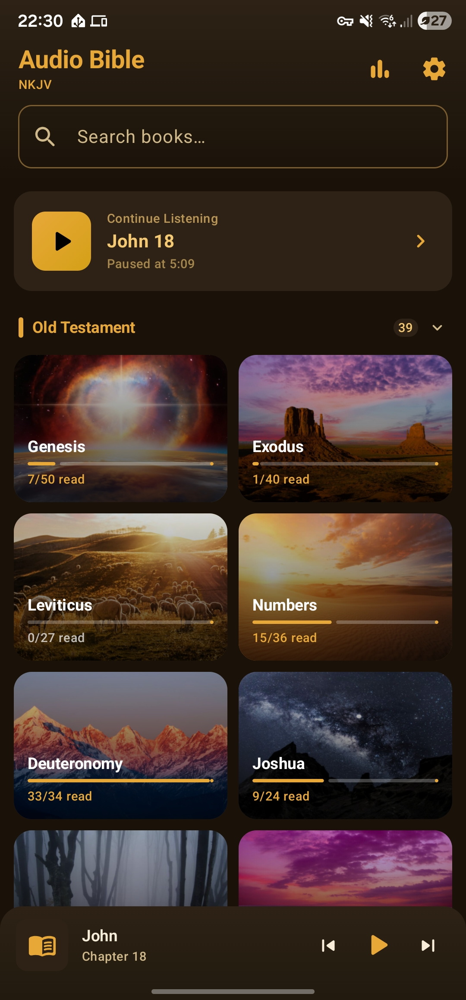
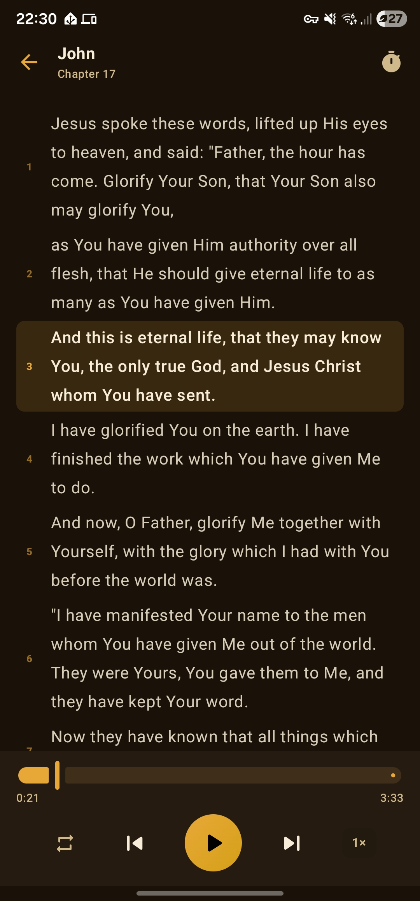
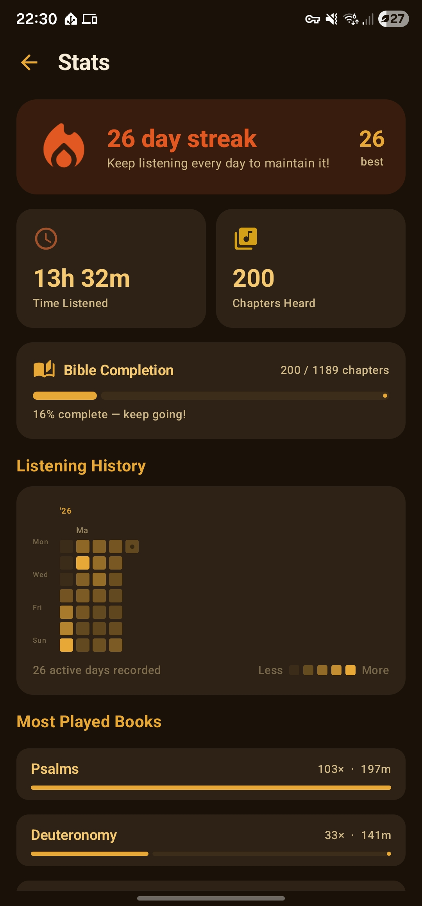
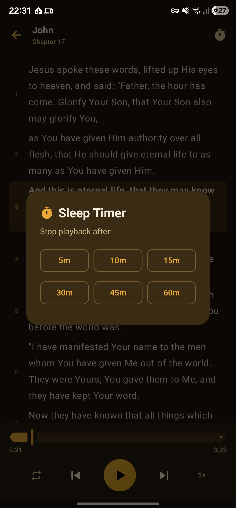

# Audio Bible

An extremely overengineered Android audio Bible player with synchronized text, multi-translation support, and playback controls.

## Screenshots

  
  
   
  
  

## Features

- **Audio playback** — play Bible audio by book and chapter using MP3 files stored on your device
- **Verse sync** — text highlights in sync with audio via JSON sync files
- **Multiple translations** — import [`.fsb`](https://github.com/ChurchApps/json-bible#readme) Bible text files and switch between translations
- **Reading stats** — track your progress with session logs and chapter history
- **Home screen widget** — quick play/pause from your launcher
- **Android Auto** — in-car playback support with book art

## Requirements

- Android 9 (API 28) or higher
- Audio files named: `NN_BookName_NNN.mp3` (e.g. `01_Genesis_001.mp3`)
- Optional verse sync files: `sync/NN_BookName_NNN_sync.json`

## Tech Stack

- Kotlin + Jetpack Compose (Material 3)
- Room database
- MediaBrowserService for playback
- Storage Access Framework (SAF) for file access
- Coroutines + StateFlow
